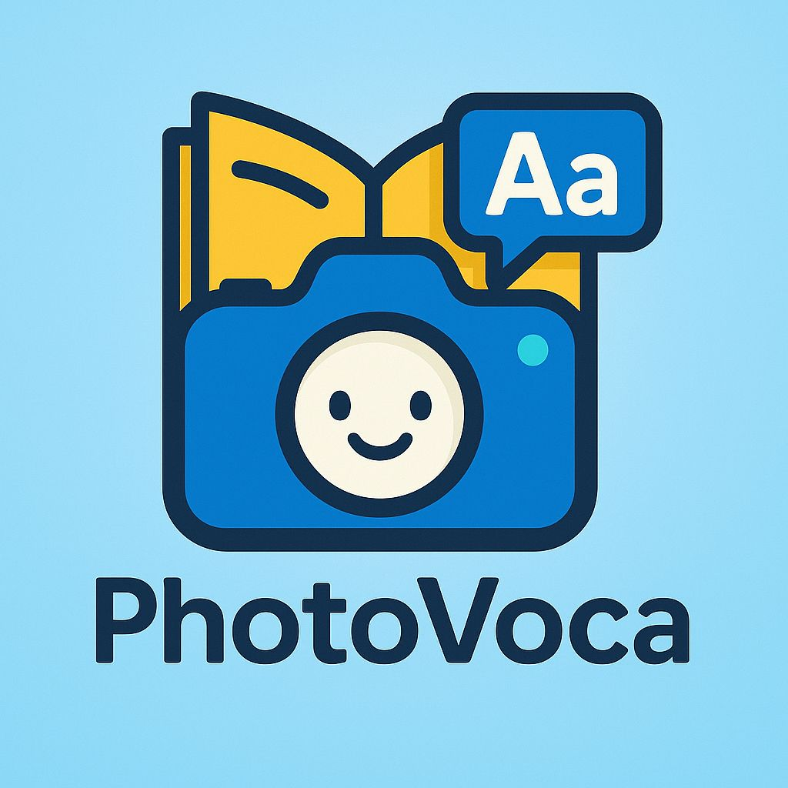

# PhotoVoca

English | [日本語](README_JP.md)

  

A Flutter application that transforms everyday objects into English vocabulary learning opportunities through camera-based object recognition.

**🏆 Excellence Award Winner at [RSS Hackathon 2025 Beyond "あたりまえ"の、その先へ](https://www.craftstadium.com/hackathon/rss-hackathon-2025-beyond) - September 7, 2025**

## Overview

PhotoVoca is a mobile app that helps users learn English vocabulary by simply taking photos of objects around them. By combining Google ML Kit's object detection with Gemini AI's description generation, it creates an engaging and memorable learning experience that connects visual recognition with language acquisition.

## Key Features

### Camera & Object Recognition
- Real-time object detection powered by Google ML Kit
- Automatic cropping of detected objects
- Multiple object selection from a single photo

### AI-Powered Content Generation
- Gemini AI generates English names and descriptions
- Context-aware practical example sentences
- Visual-linguistic association for better retention

### Flashcard Learning System
- Captured objects saved as flashcards
- Tap to reveal answers
- Swipe navigation between cards
- Learning history tracking

### Data Management
- Local SQLite database storage
- Persistent learning history
- Offline learning capability

## Tech Stack

- **Framework**: Flutter
- **State Management**: Riverpod
- **Routing**: go_router
- **AI/ML**:
  - Google Generative AI (Gemini)
  - Google ML Kit Object Detection
- **Camera**: camera
- **Database**: Drift (SQLite)
- **Image Processing**: image

## Roadmap

- Voice pronunciation feature
- Learning progress visualization
- Category-based vocabulary organization
- Multi-language support
- Cloud synchronization

## Contributing

Pull requests are welcome. For major changes, please open an issue first to discuss what you would like to change.

## Contact

For questions or suggestions, please open an issue on GitHub.